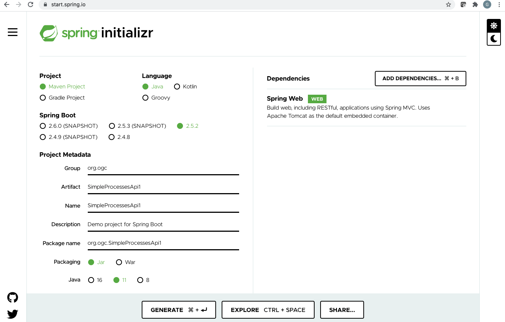
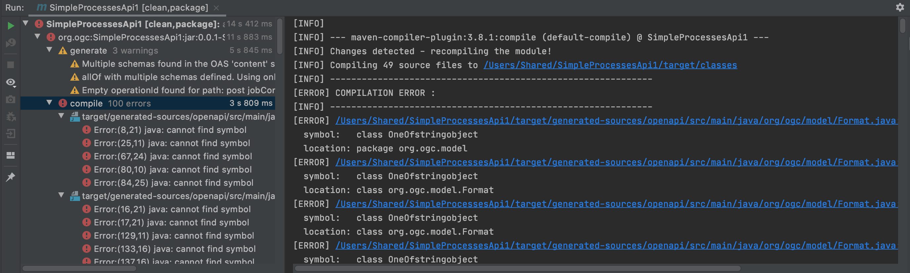
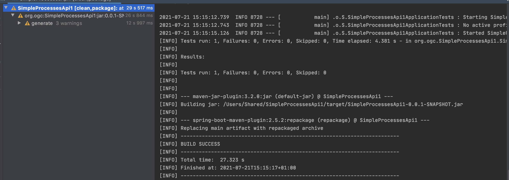
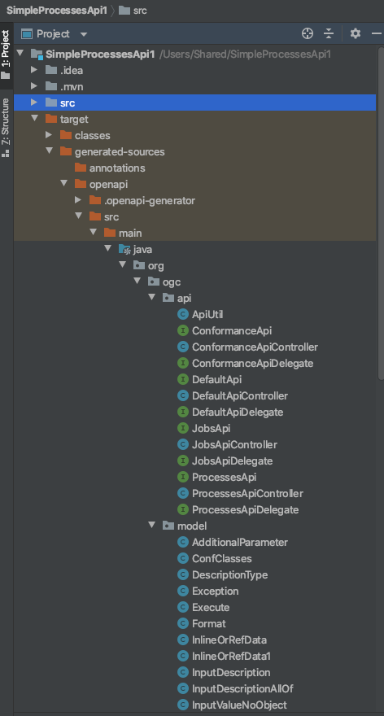
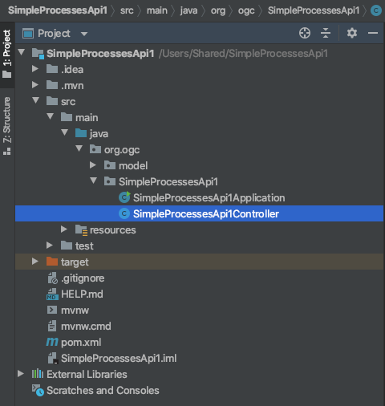

= Getting Started with Spring and OGC API - Processes
:source-highlighter: pygments

== Introduction

WARNING: This Guide is a DRAFT

This Getting Started guide introduces Java developers that use Spring to working with API definition files from the draft OGC API - Processes specification. The guide is inspired by the https://reflectoring.io/spring-boot-openapi/[API-First Development with Spring Boot and Swagger] tutorial on reflectoring.io.

== Prerequisites

* The Java Development Kit (JDK) should be installed on your machine. You can use either http://openjdk.java.net[OpenJDK] or https://www.oracle.com/java/technologies/javase-downloads.html[Oracle JDK].
* https://maven.apache.org/[Maven] should be available on your machine.
* An Integrated Development Environment (IDE). Some popular ones include https://www.eclipse.org[Eclipse], https://netbeans.org[Apache Netbeans], https://code.visualstudio.com[Microsoft Visual Code] and https://www.jetbrains.com/idea/download/[IntelliJ IDEA Community edition].

[[step1]]
== Step 1 - Creating a basic Spring boot application

First create a basic spring boot application at http://start.spring.io

Let's call the project SimpleProcessesApi1.

Ensure that you select Spring Web as a dependency.

Download the project by clicking on the GENERATE button.

Notice that the project contains a class called `SimpleProcessesApi1Application`. This is the Main Class for the application.

Now configure the application to run to serve requests through port 8081 by adding `server.port=8081` to the file `/src/main/resources/application.properties`. In this tutorial we use port 8081, you could use any port you wish.

[[step2]]
== Step 2 - Adding the OpenAPITools Generator to the maven project

Add the following to the pom.xml file.

[source,xml]
----
<plugin>
  <groupId>org.openapitools</groupId>
  <artifactId>openapi-generator-maven-plugin</artifactId>
  <version>5.2.0</version>
  <executions>
    <execution>
      <goals>
        <goal>generate</goal>
      </goals>
      <configuration>
        <inputSpec>
          ${project.basedir}/src/main/resources/openapi.yaml
        </inputSpec>
        <generatorName>spring</generatorName>
        <apiPackage>org.ogc.api</apiPackage>
        <modelPackage>org.ogc.model</modelPackage>
        <supportingFilesToGenerate>
          ApiUtil.java
        </supportingFilesToGenerate>
        <configOptions>
          <delegatePattern>true</delegatePattern>
        </configOptions>
      </configuration>
    </execution>
  </executions>
</plugin>

----

Then place the https://github.com/opengeospatial/ogcapi-code-sprint-2021-07/blob/main/Draft_Spring_Guide_for_OGC_API_Proceses/openapi.yaml[openapi.yaml] file at `/src/main/resources/` in your maven project. This yaml file uses OpenAPI to specify a Prototype Profile of the Building Blocks of OGC API - Processes - Part 1: Core.

WARNING: These are not the official Building Blocks of OGC API - Processes - Part 1: Core.

[[step3]]
== Step 3 - Adding supporting libraries to the project

We are next going to add a series of libraries to the pom.xml file. Some
of those libraries have the same version number, so to make it easier to
manage the version numbers we will add the version numbers to the
pom.xml file as properties. This is shown below.

[source,xml]
----
<properties>
  <java.version>11</java.version>
  <swagger-annotations-version>1.5.22</swagger-annotations-version>
  <jackson-version>2.12.4</jackson-version>
  <jackson-databind-nullable>0.2.1</jackson-databind-nullable>
  <springfox-version>3.0.0</springfox-version>
</properties>
----

You will need to add the following libraries.

[source,xml]
----
<dependency>
  <groupId>org.springframework.boot</groupId>
  <artifactId>spring-boot-starter-web</artifactId>
</dependency>

<dependency>
  <groupId>org.springframework.boot</groupId>
  <artifactId>spring-boot-starter-test</artifactId>
  <scope>test</scope>
</dependency>

<dependency>
  <groupId>org.springframework.boot</groupId>
  <artifactId>spring-boot-starter-validation</artifactId>
</dependency>
<dependency>
  <groupId>io.swagger</groupId>
  <artifactId>swagger-annotations</artifactId>
  <version>${swagger-annotations-version}</version>
</dependency>
<dependency>
  <groupId>org.openapitools</groupId>
  <artifactId>jackson-databind-nullable</artifactId>
  <version>${jackson-databind-nullable}</version>
</dependency>
<dependency>
  <groupId>com.fasterxml.jackson.jaxrs</groupId>
  <artifactId>jackson-jaxrs-base</artifactId>
  <version>${jackson-version}</version>
</dependency>
<dependency>
  <groupId>com.fasterxml.jackson.core</groupId>
  <artifactId>jackson-core</artifactId>
  <version>${jackson-version}</version>
</dependency>
<dependency>
  <groupId>com.fasterxml.jackson.core</groupId>
  <artifactId>jackson-annotations</artifactId>
  <version>${jackson-version}</version>
</dependency>
<dependency>
  <groupId>com.fasterxml.jackson.core</groupId>
  <artifactId>jackson-databind</artifactId>
  <version>${jackson-version}</version>
</dependency>
<dependency>
  <groupId>com.fasterxml.jackson.jaxrs</groupId>
  <artifactId>jackson-jaxrs-json-provider</artifactId>
  <version>${jackson-version}</version>
</dependency>
<dependency>
  <groupId>com.fasterxml.jackson.datatype</groupId>
  <artifactId>jackson-datatype-joda</artifactId>
  <version>${jackson-version}</version>
</dependency>
<dependency>
  <groupId>io.springfox</groupId>
  <artifactId>springfox-swagger2</artifactId>
  <version>${springfox-version}</version>
</dependency>
----

[[step4]]
== Step 4 - Building

Now compile the OpenAPI definition by running the command:

`$ mvn clean package`

This will generate a stub of the API. Due to a current limitation of
OpenAPITools Generator (see
https://github.com/OpenAPITools/openapi-generator/issues/5381) the
compilation fails to handle elements defined as ‘oneOf’ options. So, you
will see a compilation such as shown below.

As a workaround, create the following contructor-only classes (no methods are necessary) in the
org.ogc.model package:

* OneOfinlineOrRefData1.java
* OneOfinlineOrRefData2.java
* OneOfinlineOrRefDataarray.java
* OneOfintegerstring.java
* OneOfschema1reference.java
* OneOfschema1referenceboolean.java
* OneOfschema2reference2.java
* OneOfschema2reference2boolean.java
* OneOfstringnumberinteger.java
* OneOfstringnumberintegerarrayobject.java
* OneOfstringnumberintegerobjectbooleanfilemap.java
* OneOfstringobject.java

Now re-compile the OpenAPI definition by running the command:

`$ mvn clean package`

If successful, you should arrive at a `BUILD SUCCESS` message.

[[step5]]
== Step 5 - Creating the Controller

At this point, you now have the API and model stub that you will need to
implement an interface that conforms to OGC API – Processes.

In the ‘target’ folder you will find a folder called ‘generated-sources’
that includes stubs for the API controllers and model.

The classes `ProcessesApi`, `ConformanceApi`, `DefaultApi`, and `JobsApi`
contain the request mappings for each path specified in the OpenAPI
definition. These API stubs also have associated Controller classes
namely `ProcessesApiController`, `ConformanceApiController`,
`DefaultApiController`, and `JobsApiController`.

So we next override the methods provided by the API classes
generated by the OpenAPITools Generator. Overriding these methods
enables us to add business logic to those methods.

So we create a class called `SimpleProcessesApi1Controller` to sit alongside the
`SimpleProcessesApi1Application` that was created by the initializr on
start.sprint.io in <<step1>>.

Next copy the stub of the `DefaultApi.getLandingPage` method into the
`SimpleProcessesApi1Controller` class. Then insert the following code inside the `SimpleProcessesApi1Controller.getLandingPage` method.

[source,java,linenums]
----

package org.ogc.SimpleProcessesApi1;

import io.swagger.annotations.*;
import io.swagger.annotations.Api;
import io.swagger.annotations.ApiOperation;
import io.swagger.annotations.ApiResponse;
import io.swagger.annotations.ApiResponses;
import org.ogc.api.ConformanceApi;
import org.ogc.api.DefaultApi;
import org.ogc.api.DefaultApiDelegate;
import org.ogc.model.*;
import org.ogc.model.Exception;
import org.ogc.model.Process;
import org.springframework.http.HttpHeaders;
import org.springframework.http.HttpStatus;
import org.springframework.http.ResponseEntity;
import org.springframework.stereotype.Controller;
import org.springframework.web.bind.annotation.*;

import javax.validation.Valid;
import java.net.URI;
import java.time.OffsetDateTime;
import java.time.ZoneOffset;
import java.util.ArrayList;
import java.util.HashMap;
import java.util.List;
import java.util.Map;

@Controller
@Api(value = "processesApi")
public class SimpleProcessesApi1Controller {

    private String endpoint = "http://localhost:8081";

    public Link createLink(String title, String rel, String type, String href)
    {
        Link link = new Link();
        link.setRel(rel);
        link.setType(type);
        link.setTitle(title);
        link.setHref(href);

        return link;
    }

    /**
     * GET / : landing page of this API
     */
    @ApiOperation(value = "landing page of this API", nickname = "getLandingPage", notes = "The landing page provides links to the:   * The APIDefinition (no fixed path),   * The Conformance statements (path /conformance),   * The processes metadata (path /processes),   * The endpoint for job monitoring (path /jobs).  For more information, see [Section 7.2](http://docs.ogc.org/DRAFTS/18-062.html#sc_landing_page).", response = LandingPage.class, tags={ "Capabilities", })
    @ApiResponses(value = {
            @ApiResponse(code = 200, message = "The landing page provides links to the API definition (link relations `service-desc` and `service-doc`), the Conformance declaration (path `/conformance`, link relation `http://www.opengis.net/def/rel/ogc/1.0/conformance`), and to other resources.", response = LandingPage.class),
            @ApiResponse(code = 500, message = "A server error occurred.", response = Exception.class) })
    @GetMapping(
            value = "/",
            produces = { "application/json", "text/html" }
    )
    ResponseEntity<LandingPage> getLandingPage() {
        LandingPage lp = new LandingPage();
        lp.setTitle("OGC API - Processes tutorial for Spring.io");
        lp.setDescription("An example of an implementation of OGC API - Processes using Spring.io");

        lp.addLinksItem(createLink("this document","self", "application/json",endpoint+"?f=json"));
        lp.addLinksItem(createLink("OGC API conformance classes implemented by this server","http://www.opengis.net/def/rel/ogc/1.0/conformance","application/json",endpoint+"/conformance"));
        lp.addLinksItem(createLink("Access the processes","http://www.opengis.net/def/rel/ogc/1.0/processes","application/json",endpoint+"/processes"));
        lp.addLinksItem(createLink("Access the jobs","http://www.opengis.net/def/rel/ogc/1.0/job-list","application/json",endpoint+"/jobs"));

        HttpHeaders headers = new HttpHeaders();
        headers.add("Content-Type", "application/json");
        ResponseEntity<LandingPage> re = new ResponseEntity<LandingPage>(lp, headers, HttpStatus.OK);
        return re;

    }
}

----

Follow a similar approach of overriding the API methods generated by the OpenAPITools Generator. For example, for the conformance declaration you could override the `ConformanceAPI.getConformanceDeclaration` method using the following.

[source,java]
----

/**
 * GET /conformance : information about standards that this API conforms to
 * A list of all conformance classes, specified in a standard, that the server conforms to.
 *
 * @return The URIs of all conformance classes supported by the server.  To support \&quot;generic\&quot; clients that want to access multiple OGC API - Processes implementations - and not \&quot;just\&quot; a specific API / server, the server declares the conformance classes it implements and conforms to. (status code 200)
 *         or A server error occurred. (status code 500)
 */
@ApiOperation(value = "information about standards that this API conforms to", nickname = "getConformanceClasses", notes = "A list of all conformance classes, specified in a standard, that the server conforms to. ", response = ConfClasses.class, tags={ "ConformanceDeclaration", })
@ApiResponses(value = {
        @ApiResponse(code = 200, message = "The URIs of all conformance classes supported by the server.  To support \"generic\" clients that want to access multiple OGC API - Processes implementations - and not \"just\" a specific API / server, the server declares the conformance classes it implements and conforms to.", response = ConfClasses.class),
        @ApiResponse(code = 500, message = "A server error occurred.", response = Exception.class) })
@GetMapping(
        value = "/conformance",
        produces = { "application/json", "text/html" }
)
ResponseEntity<ConfClasses> getConformanceClasses() {

    ConfClasses cc = new ConfClasses();
    try {

        cc.addConformsToItem(new URI("http://www.opengis.net/spec/ogcapi-processes-1/1.0/conf/core").toASCIIString());
        cc.addConformsToItem(new URI("http://www.opengis.net/spec/ogcapi-processes-1/1.0/conf/json").toASCIIString());

    }
    catch(java.lang.Exception ec)
    {
        ec.printStackTrace();
    }

    HttpHeaders headers = new HttpHeaders();
    headers.add("Content-Type", "application/json");
    ResponseEntity<ConfClasses> re = new ResponseEntity<ConfClasses>(cc, headers, HttpStatus.OK);
    return re;

}

----

[[step6]]
== Step 6 - Running the application

Once you are through overriding the other API methods, run the Spring boot application with the following command.

$ mvn spring-boot:run

Now using a client application such as Postman, send a request to http://localhost:8081 to see the landing page. The response should be something like.

[source,json]
----
{
  "title": "OGC API - Processes tutorial using Spring.io",
  "description": "An example of an implementation of OGC API - Processes using Spring.io",
  "links": [
    {
      "href": "http://localhost:8081?f=json",
      "rel": "self",
      "type": "application/json",
      "hreflang": null,
      "title": "this document"
    },
    {
      "href": "http://localhost:8081/conformance",
      "rel": "http://www.opengis.net/def/rel/ogc/1.0/conformance",
      "type": "application/json",
      "hreflang": null,
      "title": "OGC API conformance classes implemented by this server"
    },
    {
      "href": "http://localhost:8081/processes",
      "rel": "http://www.opengis.net/def/rel/ogc/1.0/processes",
      "type": "application/json",
      "hreflang": null,
      "title": "Access the processes"
    },
    {
      "href": "http://localhost:8081/jobs",
      "rel": "http://www.opengis.net/def/rel/ogc/1.0/job-list",
      "type": "application/json",
      "hreflang": null,
      "title": "Access the jobs"
    }
  ]
}

----

Next send a request to http://localhost:8081/conformance to see the conformance page. The response should be something like.

[source,json]
----
{
  "conformsTo": [
    "http://www.opengis.net/spec/ogcapi-processes-1/1.0/conf/core",
    "http://www.opengis.net/spec/ogcapi-processes-1/1.0/conf/json"
  ]
}
----
