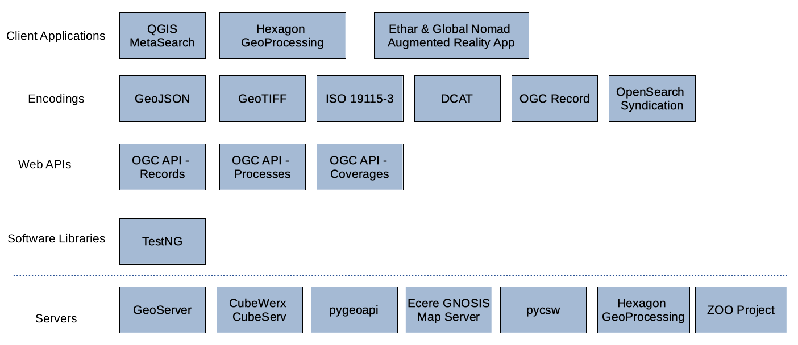

[[architecture]]
== High-Level Architecture

=== High Level Overview

The focus of the sprint was on support of the development of the draft https://ogcapi.ogc.org/records[OGC API - Records], https://ogcapi.ogc.org/processes[OGC API - Processes] and https://ogcapi.ogc.org/coverages[OGC API - Coverages] standards. Implementations of these draft standards were deployed in participants' own infrastructure in order to build a solution with the architecture shown below in <<img_architecture>>.

[#img_architecture,reftext='{figure-caption} {counter:figure-num}']
.High level overview of the architecture implemented during the sprint

As illustrated, the sprint architecture was designed with the view of enabling client applications to connect to different servers that implement OGC APIs. The servers were provisioned with metadata, implementations of algorithms for geospatial analysis, vector feature data, and coverages such as satellite imagery.

=== Candidate Standards

==== OGC API - Processes

The draft OGC API - Processes specification defines an interface that enables the execution of geospatial computing processes and the retrieval of metadata describing their purpose and functionality. Typically, these processes execute implementations of well-defined algorithms that ingest vector and/or coverage data to produce new datasets or analytical products.

==== OGC API - Records

The draft OGC API - Records specification defines an interface that enables discovery and access to metadata records about resources such as features, coverages, tiles / maps, models, assets, services or widgets. The draft specification enables the discovery of geospatial resources by standardizing the way collections of descriptive information about the resources (metadata) are exposed and accessed.

==== OGC API - Coverages

The draft OGC API - Coverages specification defines an interface that enables access to coverages that are modeled according to the Coverage Implementation Schema (CIS) 1.1. Coverages are represented by some binary or ASCII serialization, specified by some data (en­coding) format. Arguably the most popular type of coverage is that of a gridded coverage. Gridded coverages have a grid as their domain set describing the direct positions in multi-dimensional coordinate space, depending on the type of grid. Satellite imagery is typically modeled as a gridded coverage, for example.
