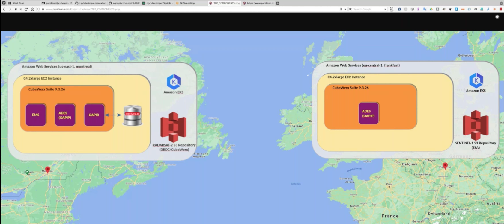
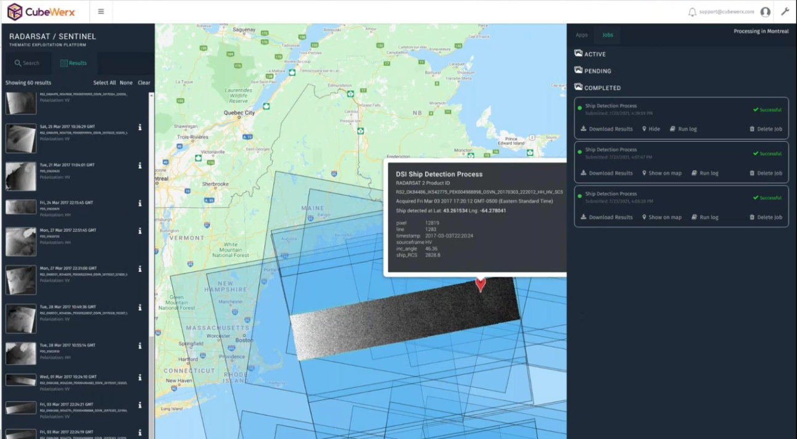
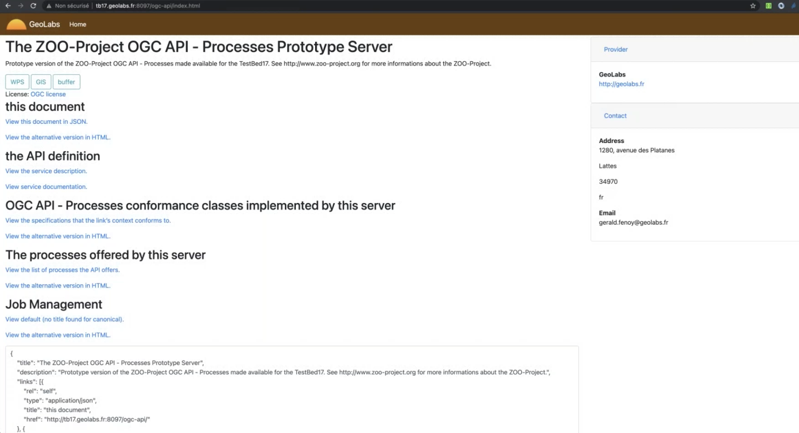
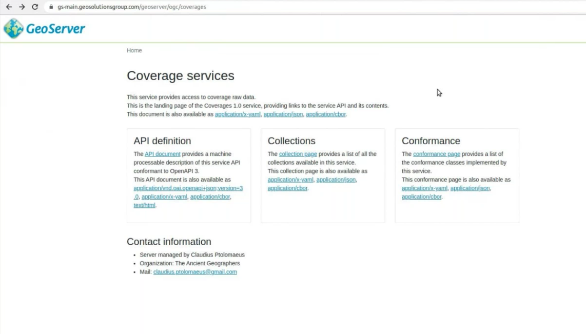
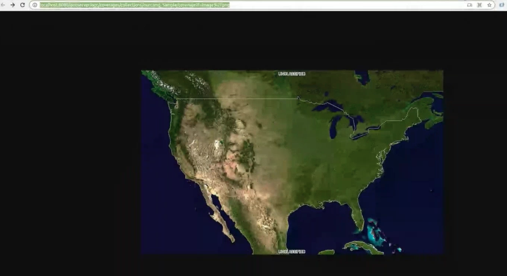
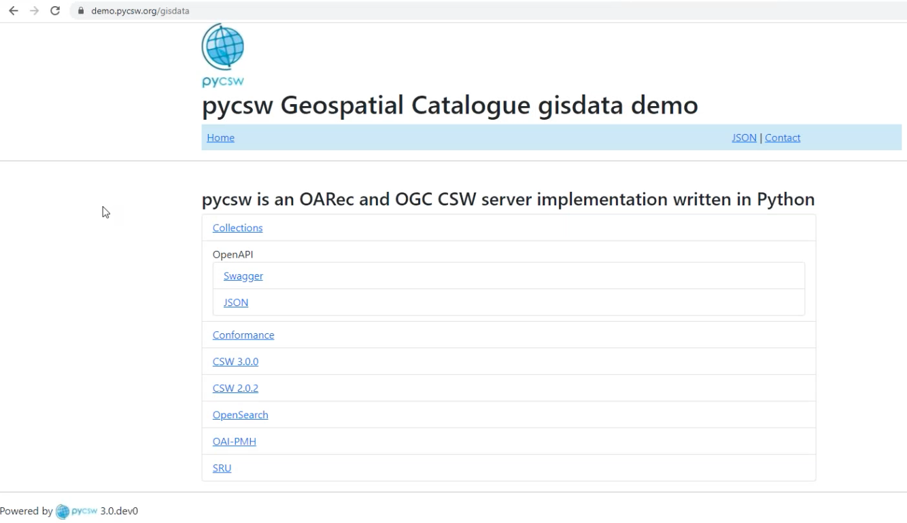
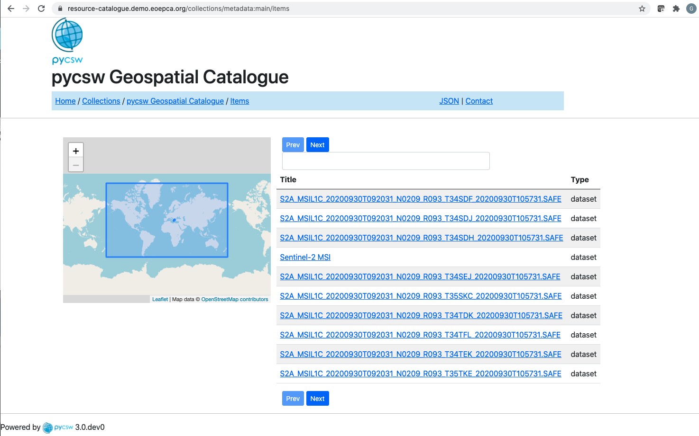
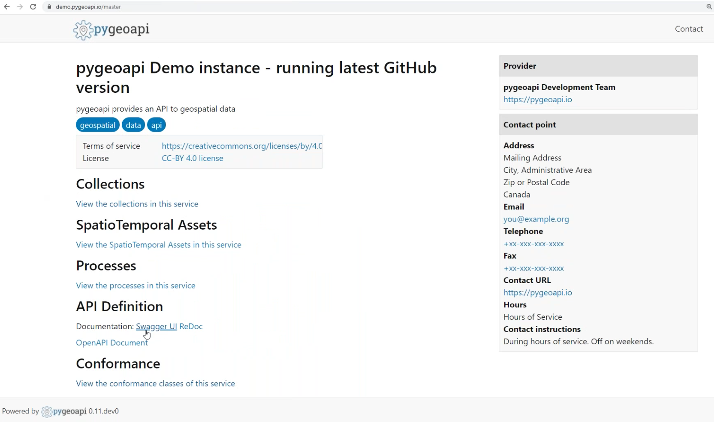
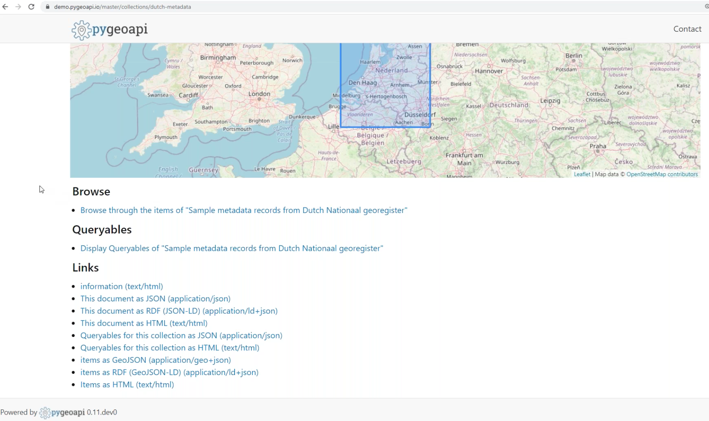
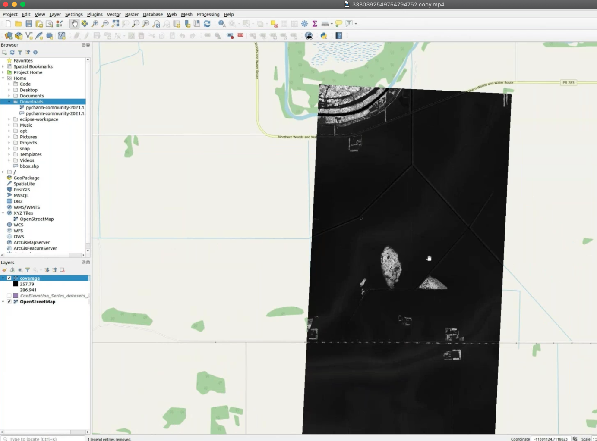

[[results]]
== Results

Multiple organizations provided servers, API implementations, and capabilities during the event. The rest of this section describes each of the implementations.

=== CubeWerx

The CubeWerx server ("cubeserv") supports a wide variety of back ends including Oracle, MariaDB, SHAPE files, etc. It also supports a wide array of service-dependent output formats (e.g. GML, GeoJSON, Mapbox Vector Tiles, MapMP, etc.) and coordinate reference systems. During this code sprint, CubeWerx helped fine-tune and mature several aspects of the OGC API Coverages, Processes and Records specifications, and refined its implementation accordingly. CubeSERV supports multiple OGC API specifications.

[#img_cubewerx1,reftext='{figure-caption} {counter:figure-num}']
.Screenshot from a demonstration of CubeSERV

[#img_cubewerx2,reftext='{figure-caption} {counter:figure-num}']
.A second screenshot from a demonstration of CubeSERV

=== ZOO Project

Developers from Geolabs deployed an instance of ZOO Project, an open source platform written in C that implements a number of interface standards for geospatial processing, including OGC API - Processes and multiple versions of the WPS standard. The ZOO Project instance deployed for the code sprint offered wrappers around libraries such as the Orfeo Toolbox (OTB) and software such as GRASS GIS and SAGA GIS. This meant that through the OGC API - Processes interface, a client application could invoke the processing and analytical functions offered by these software packages. A screenshot of a landing page from a Geolabs ZOO Project instance is shown in <<img_geolabs1>>.

[#img_geolabs1,reftext='{figure-caption} {counter:figure-num}']
.A landing page from a Geolabs ZOO Project instance

A screenshot of a  request and response from a completed processing job executed on ZOO Project is shown in <<img_geolabs2>>.

[#img_geolabs2,reftext='{figure-caption} {counter:figure-num}']
.A request and response from a completed processing job executed on ZOO Project
image::images/geolabs2.png[width=800,align="center"]

=== GeoServer

GeoSolutions deployed an instance of the GeoServer product. GeoServer is a Java-based software server that allows users to view and edit geospatial data. GeoServer supports multiple OGC API specifications. For this code sprint, the server was configured to offer an endpoint supporting multiple conformance classes and recommendations from the draft OGC API - Coverages - Part 1: Core specification. The development focused on updating the OGC API - Coverages implementation to the latest evolution of the spec, building on GeoServer's existing support for the Web Coverage Service (WCS) standard.

[#img_geoserver1,reftext='{figure-caption} {counter:figure-num}']
.The landing page of the OGC API - Coverages implementation of GeoServer

[#img_geoserver2,reftext='{figure-caption} {counter:figure-num}']
.A coverage retrieved from the OGC API - Coverages implementation of GeoServer

=== Global Nomad Augmented Reality Application

TBA

=== Hexagon Geoprocessing

TBA

=== QGIS MetaSearch Plugin

TBA

=== OpenWork

TBA

=== pycsw

During the code sprint, developers from the Open Source Geospatial Foundation (OSGeo) deployed an instance of https://pycsw.org[pycsw], an open source server-side python implementation of the OGC Catalogue Services for the Web (CSW) standard. The pycsw software product allows for the publishing and discovery of geospatial metadata via numerous APIs (CSW 2.0.2, CSW 3.0.0, OpenSearch Syndication Protocol, and others), providing a standards-based metadata and catalogue component of spatial data infrastructures. The OSGeo developers extended the pycsw code base to include support for OGC API - Records. A screenshot of the landing page of one of the pycsw instances is shown in <<img_pycsw1>>.

[#img_pycsw1,reftext='{figure-caption} {counter:figure-num}']
.The landing page of one of the pycsw instances

A screenshot of a series of metadata records from a collection accessed on an instance pycsw is shown in <<img_pycsw2>>.

[#img_pycsw2,reftext='{figure-caption} {counter:figure-num}']
.A series of metadata records from a collection accessed on an instance pycsw

=== pygeoapi

A number of sprint participants deployed instances of https://pygeoapi.io[pygeoapi] and worked collaboratively to enhance the software's support for OGC APIs. Participants working on pygeoapi included developers from OSGeo, Meteorological Service of Canada (MSC), 52 North, GeoCat BV and Geobeyond Srl. pygeoapi is an open source Python server implementation of the OGC API suite of standards.  The product supports the microservices approach and allows for scalability and cloud friendly deployment.

==== Accessing metadata records

Developers from MSC, OSGeo, GeoCat BV and Geobeyond Srl configured an instance of pygeoapi to enable access to metadata records. A screenshot of the landing page of one of the pygeoapi instances is shown in <<img_pygeoapi1>>.

[#img_pygeoapi1,reftext='{figure-caption} {counter:figure-num}']
.The landing page of one of the pygeoapi instances

A screenshot of an overview of one of the collections of metadata records offered by one of the pygeoapi instances is shown in <<img_pygeoapi2>>.

[#img_pygeoapi2,reftext='{figure-caption} {counter:figure-num}']
.An overview of one of the collections of metadata records offered by one of the pygeoapi instances

==== Accessing coverages

Developers from 52 North configured an instance of pygeoapi to enable access to Data Cubes, initially deployed for Testbed-17. A screenshot of the pygeoapi interface from the 52 North Data Cube demonstration is shown in <<img_52northDataCube1>>.

[#img_52northDataCube1,reftext='{figure-caption} {counter:figure-num}']
.Screenshot of pygeoapi interface from the 52 North Data Cube demonstration
image::images/52northDataCube1.png[width=600,align="center"]

Once coverages from the data cube are published through the pygeoapi, they can be accessed through the OGC API - Coverages interface and displayed on a client application such as QGIS. A coverage displayed using QGIS after download from a data cube is shown in <<img_52northDataCube2>>.

[#img_52northDataCube2,reftext='{figure-caption} {counter:figure-num}']
.Coverage displayed using QGIS after download from the 52 North Data Cube supplied using pygeoapi

=== Other Outputs

Other developments and software deployments during the code sprint included:

* The OGC Compliance Program provides a free online testing facility, called the OGC Validator, that is based on Team Engine. The Compliance Program also provides a set of test suites dedicated to specific protocols and versions, as well as specification profiles and extension. For this code sprint, an https://maven.apache.org[Apache Maven] project was set up in a  https://github.com/opengeospatial/ets-ogcapi-coverages10[GitHub repository] for the executable test suite of OGC API – Coverages draft standard.

* A https://github.com/opengeospatial/ogcapi-code-sprint-2021-07/tree/main/Draft_Spring_Guide_for_OGC_API_Proceses[draft user guide] was developed for software developers that use the https://spring.io/projects/spring-framework[Spring Framework] to build implementation of OGC API - Processes. The Spring Framework is an open source application framework and inversion of control container for the Java Platform. The user guide developed during the code sprint made use of Spring along with OpenAPI Tools Generator.
